# CRM Sales Opportunities — SQL Analysis Project

A data analysis project using the Maven Analytics "CRM Sales Opportunities"
dataset to extract business insights on sales performance, pipeline health,
product profitability, and account/regional trends. The project follows a
full analytics workflow — business understanding, data audit, schema design,
exploratory SQL, business analysis, advanced SQL, and visualization — using
MySQL for querying and Python (pandas, matplotlib, seaborn) for charts.

---

## Tools Used

- MySQL 8.0 + MySQL Workbench for database design and querying
- Python (pandas, SQLAlchemy, matplotlib, seaborn) for chart generation
- SQL: joins, subqueries, CTEs, window functions, aggregates, foreign key constraints

---

## Project Structure

```
SQL PROJECT/
├── CRM+Sales+Opportunities/   # Raw source CSVs (accounts, products, sales_teams, sales_pipeline)
├── docs/                      # Written analysis: business understanding, ER diagram, guides
│   ├── 01_business_understanding.md
│   ├── 03_er_diagram.md
│   ├── 04_exploratory_sql_guide.md
│   └── 05_business_questions.md
├── sql/
│   └── 01_schema.sql          # Canonical CREATE TABLE / constraints script
├── scripts/                   # SQL history from the design + load process, and the audit script
│   ├── audit_dataset.py       # Pandas-based data quality audit (Phase 2)
│   ├── exploratory_sql.sql    # Phase 4 exploratory queries
│   └── business insights.sql  # Phase 5: 50+ business question queries
├── python_scripts/            # One script per chart (query -> pandas -> seaborn plot)
├── visuals/                   # Saved chart images (generated by python_scripts)
├── requirements.txt
└── README.md
```

---

## Methodology

1. **Business Understanding** — CRM domain concepts (accounts, pipeline stages,
   sales org hierarchy) documented before writing any SQL.
2. **Dataset Audit** — a pandas script inspected all 4 source tables for nulls,
   duplicate keys, referential integrity, and data quality issues (e.g. a
   `'GTXPro'` vs `'GTX Pro'` mismatch, ~1,425 pipeline rows with no linked
   account, 6 managers who never appear as agents themselves).
3. **Database Design** — a star-schema MySQL database (`sales_pipeline` as the
   fact table; `accounts`, `products`, `sales_teams` as dimensions), with
   primary keys, foreign keys, and an ER diagram.
4. **Exploratory SQL** — validated the load against the audit (row counts,
   distributions, null patterns, sales-cycle-length ranges).
5. **Business Analysis** — 50+ questions across sales performance, pipeline
   health, product profitability, account/sector trends, regional
   performance, time-based trends, and deal-size analysis.
6. **Advanced SQL** — CTEs, window functions (`RANK`, `ROW_NUMBER`,
   `PERCENT_RANK`), and (in progress) views, stored procedures, triggers,
   and indexing.
7. **Visualization** — key findings charted with Python (see below).

---

## Key Analyses & Charts

Each chart is produced by its matching script in `python_scripts/` and saved
to `visuals/`. Run the script to regenerate the image below it.

### Sales Performance

- **Top Agents by Revenue**
  Ranks the top 10 sales agents by total Won revenue.
  `python_scripts/top_agents_by_revenue.py`
  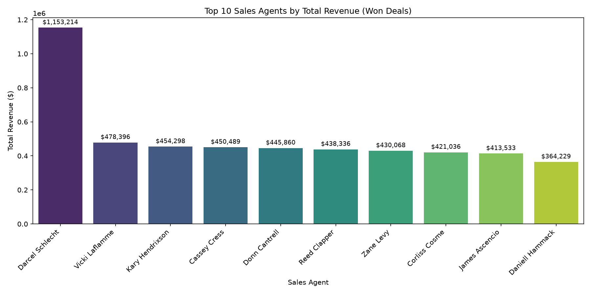

- **Win Rate by Manager**
  Compares each manager's team win rate (Won / (Won + Lost)).
  `python_scripts/win_rate_by_manager.py`
  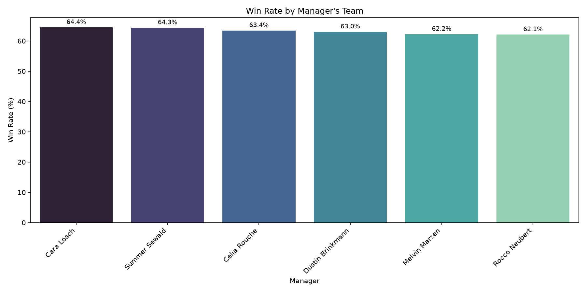

---

### Pipeline / Funnel Analysis

- **Deal Stage Funnel**
  Deal count across Prospecting → Engaging → Won/Lost.
  `python_scripts/deal_stage_funnel.py`
  

- **Sales Cycle Length: Won vs. Lost**
  Average number of days from engagement to close, split by outcome.
  `python_scripts/sales_cycle_won_vs_lost.py`
  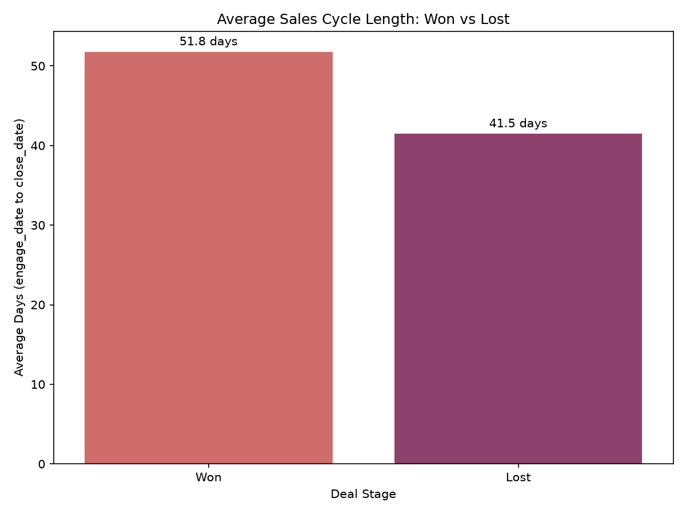

---

### Product Analysis

- **Revenue by Product Series**
  Total revenue rolled up by product series (GTX / GTK / MG).
  `python_scripts/revenue_by_product_series.py`
  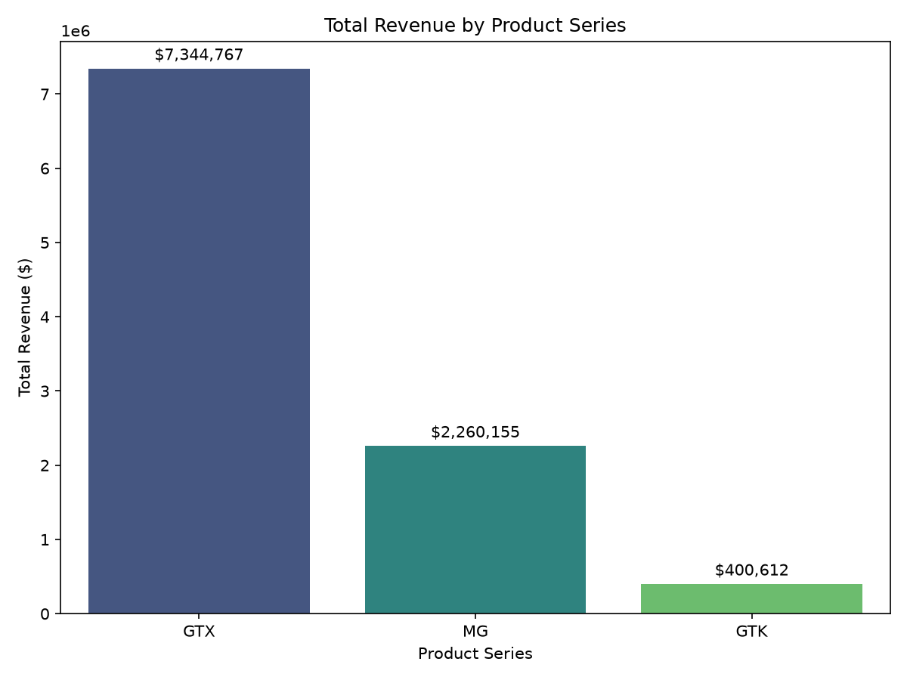

- **Discount vs. List Price**
  Average realized discount against list price, per product.
  `python_scripts/product_discount_analysis.py`
  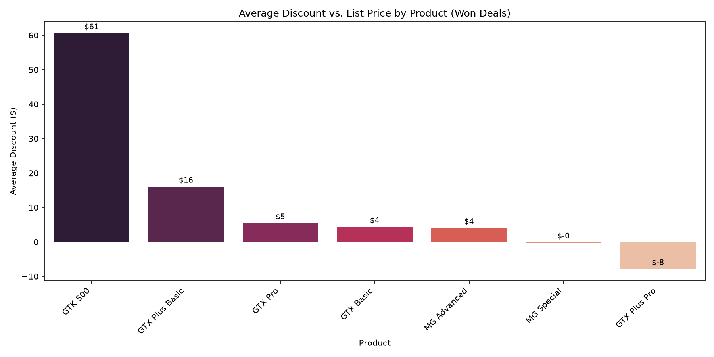

---

### Account / Sector Analysis

- **Revenue by Sector**
  Total revenue aggregated by customer industry sector.
  `python_scripts/revenue_by_sector.py`
  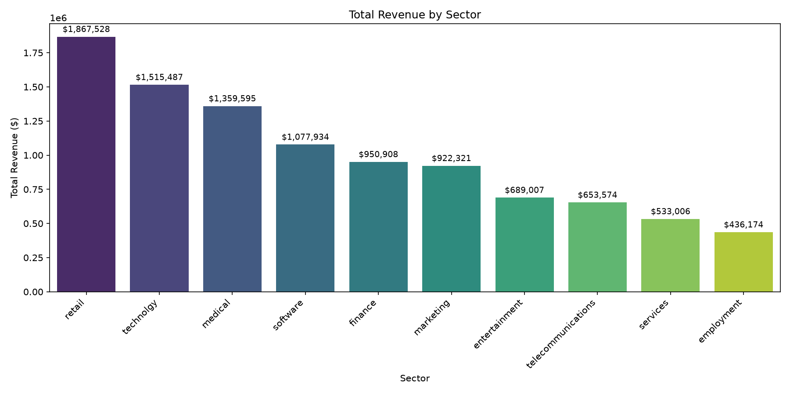

- **Company Size vs. Deal Size**
  Average deal size grouped by account company-size bucket.
  `python_scripts/company_size_vs_deal_size.py`
  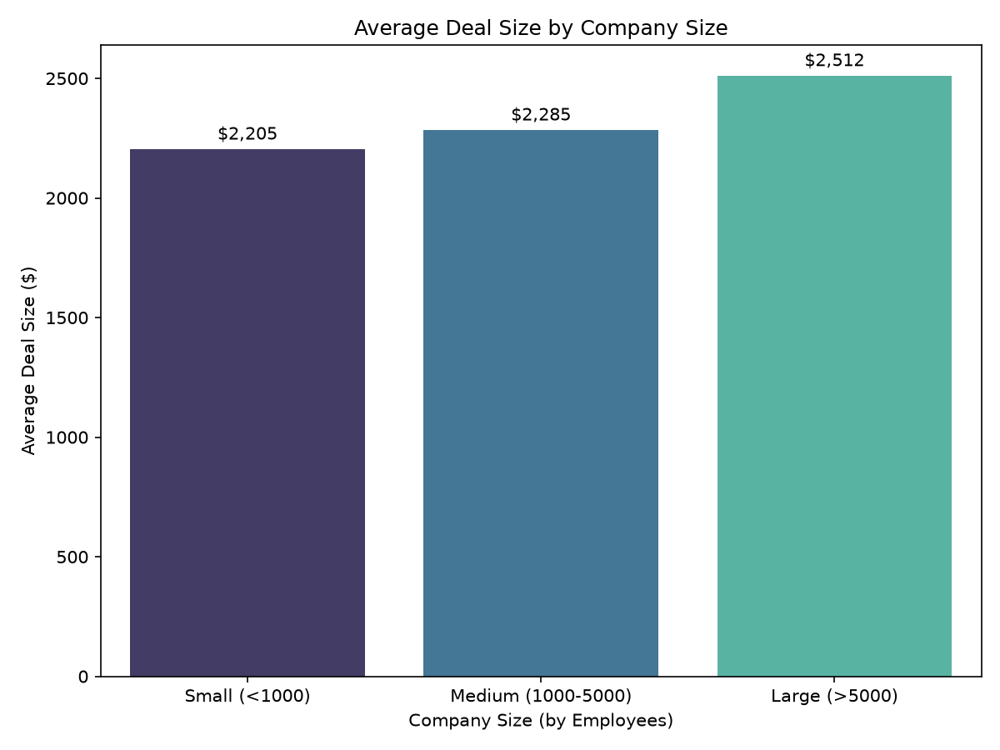

---

### Regional Analysis

- **Revenue by Region**
  Total revenue by regional office.
  `python_scripts/revenue_by_region.py`
  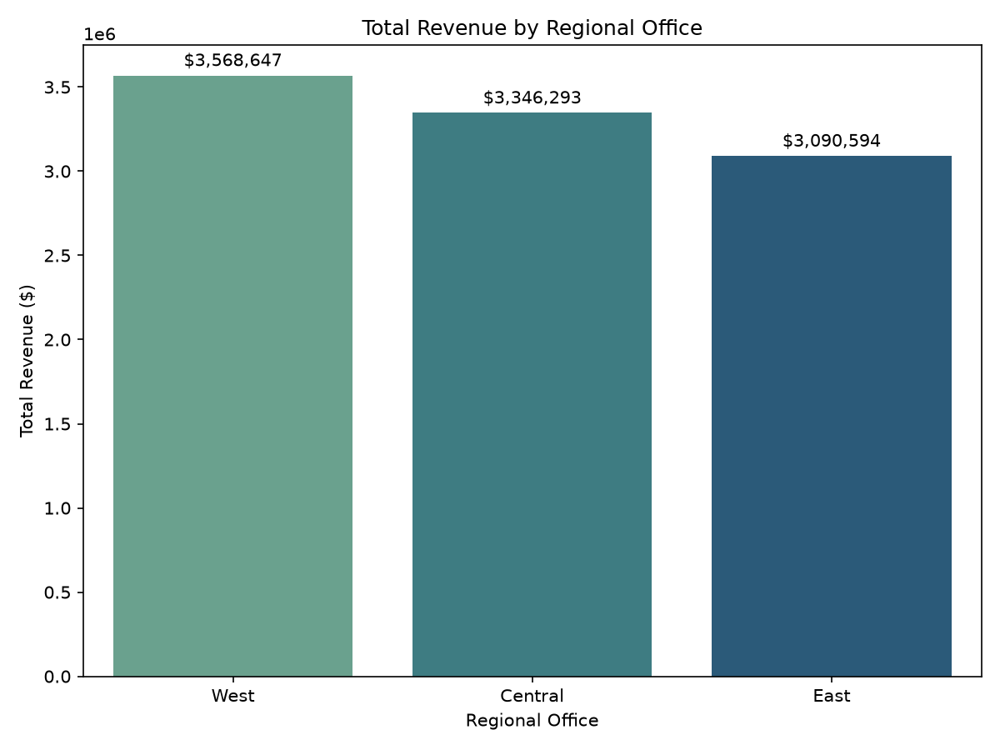

- **Revenue per Agent, by Region**
  Revenue-per-agent efficiency across regional offices.
  `python_scripts/revenue_per_agent_by_region.py`
  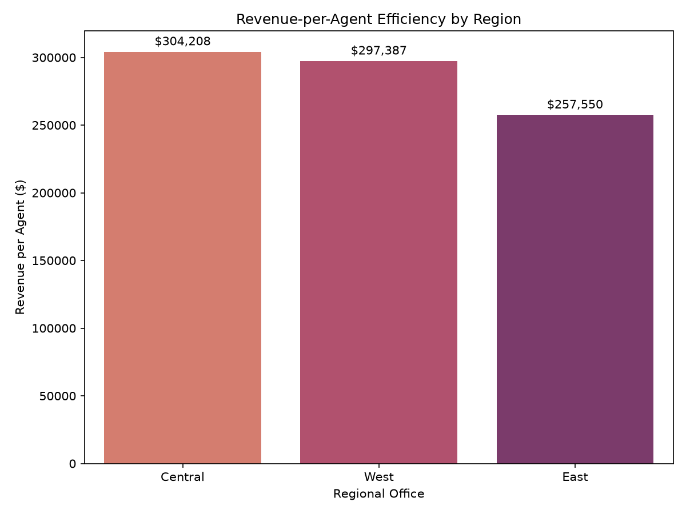

---

### Time-Based Trends

- **Monthly Revenue Trend**
  Monthly Won revenue across the full dataset time range.
  `python_scripts/monthly_revenue_trend.py`
  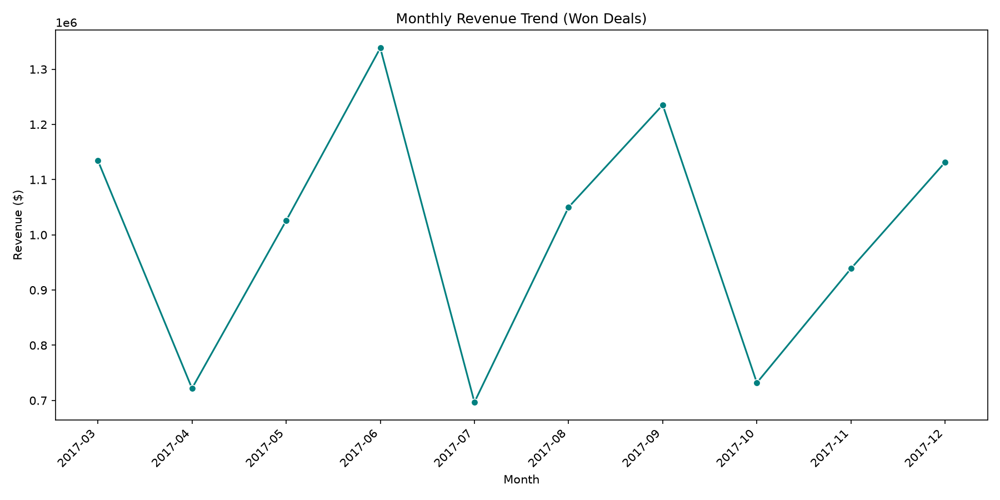

---

### Deal Size Analysis

- **Deal Size Distribution**
  Won deal count split into small / medium / large value buckets.
  `python_scripts/deal_size_distribution.py`
  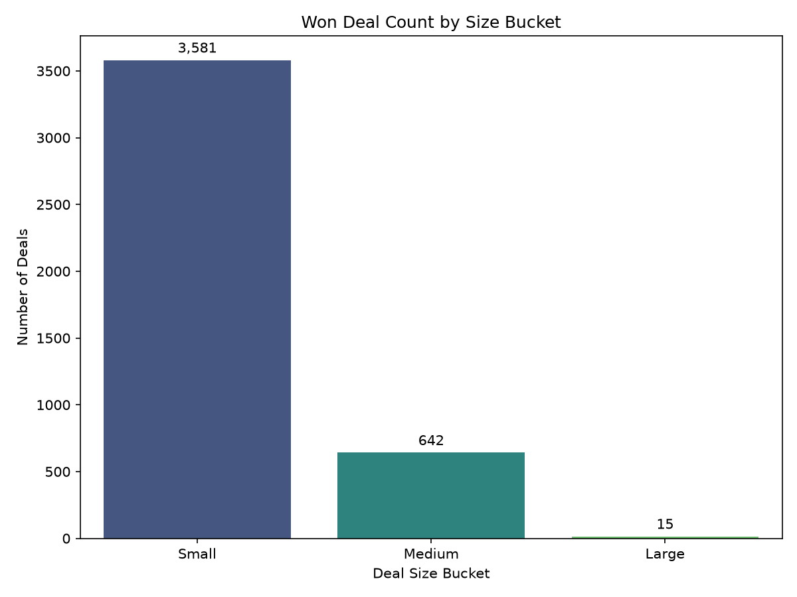

---

## How to Run

1. **Set up MySQL**
   Install MySQL 8.0, then run `sql/01_schema.sql` to create the database
   and tables.

2. **Load the data**
   Import the 4 CSVs from `CRM+Sales+Opportunities/` into their matching
   tables (see `docs/03_er_diagram.md` for load-order and data-quality notes
   — `sales_pipeline` in particular needs the `'GTXPro'` fix and NULL
   handling for blank cells before/while loading).

3. **Run the SQL analysis**
   Execute `scripts/exploratory_sql.sql` and `scripts/business insights.sql`
   in MySQL Workbench (or any MySQL client) to reproduce the full analysis.

4. **Generate the charts**
   ```bash
   pip install -r requirements.txt
   ```
   Set your DB credentials as environment variables, then run any script in
   `python_scripts/`:
   ```bash
   # PowerShell
   $env:DB_PASSWORD = "your_password_here"
   python python_scripts/top_agents_by_revenue.py
   ```
   (`DB_HOST`, `DB_USER`, `DB_NAME` default to `localhost`, `root`,
   `crm_sales_opportunities` respectively — override via environment
   variables if yours differ.)

---

## Skills Demonstrated

- Data auditing and quality assessment with pandas before schema design
- Relational schema design: primary keys, foreign keys, self-referencing
  keys, nullable relationships, and documented design trade-offs
- SQL: joins, aggregates, `CASE` logic, subqueries, CTEs, and window
  functions (`RANK`, `ROW_NUMBER`, `PERCENT_RANK`)
- Debugging real-world data load issues (encoding quirks, duplicate keys,
  type mismatches) directly in MySQL Workbench
- Business-oriented analysis: translating raw tables into sales performance,
  pipeline, and revenue insights
- Data visualization with pandas + seaborn/matplotlib
