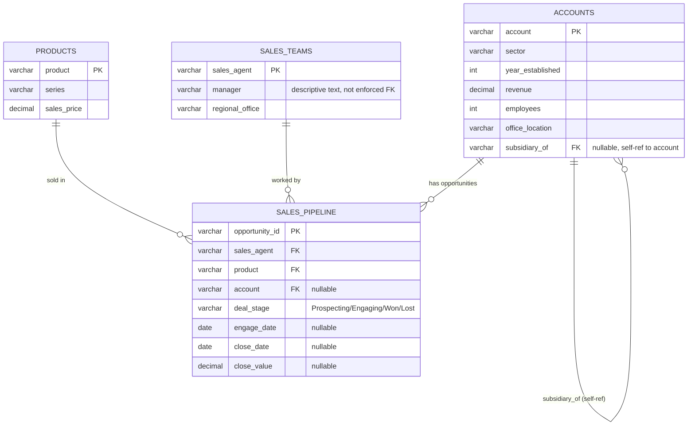

# 3. Entity-Relationship Diagram

Based on the dataset audit findings:
- `sales_pipeline` is the fact table; `accounts`, `products`, `sales_teams` are dimensions (star schema).
- `sales_pipeline.account` is nullable (1,425 rows have no account — likely early Prospecting-stage deals).
- `sales_pipeline.product` has a data quality issue (`'GTXPro'` vs `'GTX Pro'`) that must be cleaned before enforcing an FK constraint.
- `accounts.subsidiary_of` is a self-referencing FK (parent company is itself an account, or NULL if independent).
- `sales_teams.manager` is NOT a formal FK to `sales_agent` — 6 managers in the data never appear as agents themselves, so this is just a descriptive text column, not an enforced relationship.

## Cardinality summary

| Relationship | Cardinality | Notes |
|---|---|---|
| accounts → sales_pipeline | 1 : N | one account can have many deals; account may be NULL |
| products → sales_pipeline | 1 : N | one product sold across many deals |
| sales_teams → sales_pipeline | 1 : N | one agent works many deals |
| accounts → accounts | 1 : N (self) | parent company → subsidiaries |
